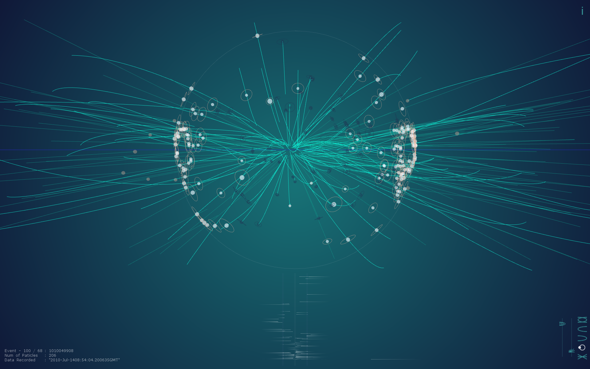

# LHC CERN Data Audio Generator

This application works just on Mac OS Yosemite and oF 0.8.4    

I used some codes of two projects from    
Spectrum Generator [https://github.com/dfeles/refreq](https://github.com/dfeles/refreq)    
ofxUnZip [https://github.com/mazbox/ofxUnZip](https://github.com/mazbox/ofxUnZip)    

Mac Binary Version download : [http://www.jeonghopark.de/media/lhc_data_music.app.zip](http://www.jeonghopark.de/media/lhc_data_music.app.zip)

More ig Files are    
[http://opendata.cern.ch/record/301](http://opendata.cern.ch/record/301)    

A project by JeongHo Park
