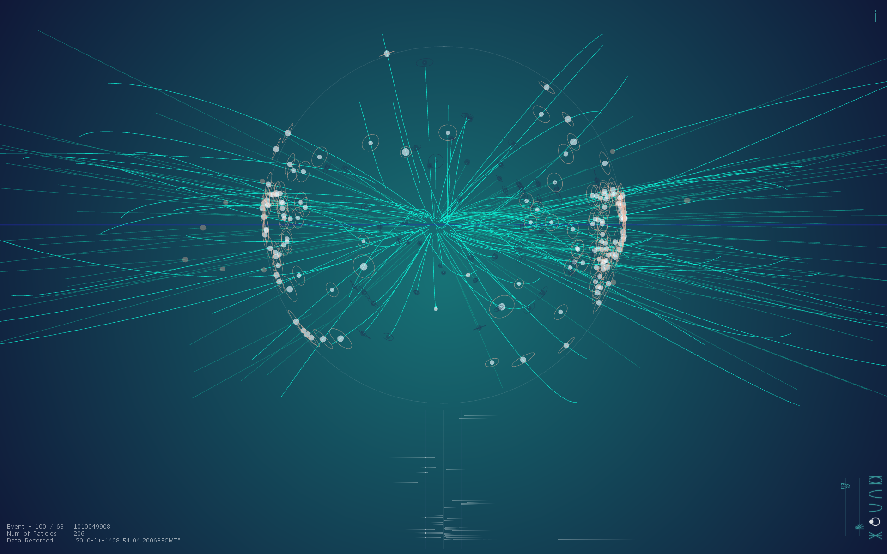

# LHC CERN Data Audio Generator

An interactive audiovisual application that converts particle physics data from CERN's Large Hadron Collider (LHC) into sound and 3D visualizations.

## Requirements

- macOS 11.5+
- openFrameworks 0.11+
- C++23

## Features

- Sonification of CERN CMS detector event data using additive synthesis (512 frequency bins, 44.1kHz)
- Real-time 3D visualization of detector geometry (EB, EE, ES, HB, HE, HF) and particle trajectories
- Scrolling spectrogram display synchronized with audio playback
- Interactive controls: event navigation, auto-play, speed/volume adjustment
- Drag & drop support for loading .ig event files

## Data

Event data is in CERN's iSpy `.ig` format (ZIP-compressed).
More .ig files are available at [CERN Open Data Portal](http://opendata.cern.ch/record/301).

## Credits

Based on code from:
- Spectrum Generator: [https://github.com/dfeles/refreq](https://github.com/dfeles/refreq)
- ofxUnZip: [https://github.com/mazbox/ofxUnZip](https://github.com/mazbox/ofxUnZip)

## Author

A project by JeongHo Park
